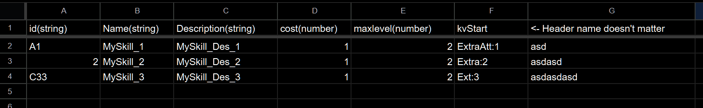
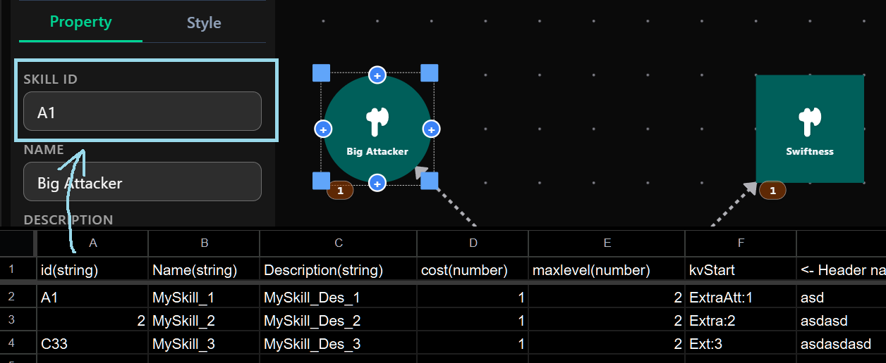
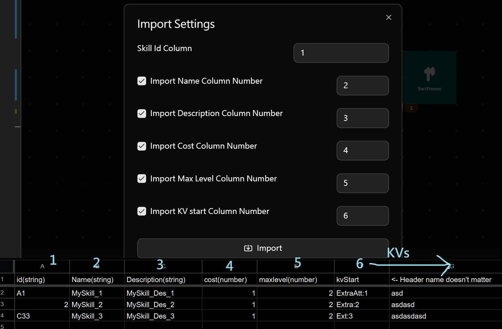
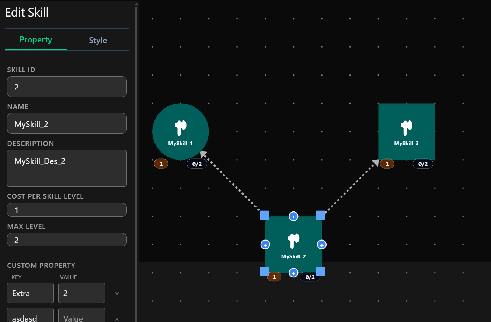
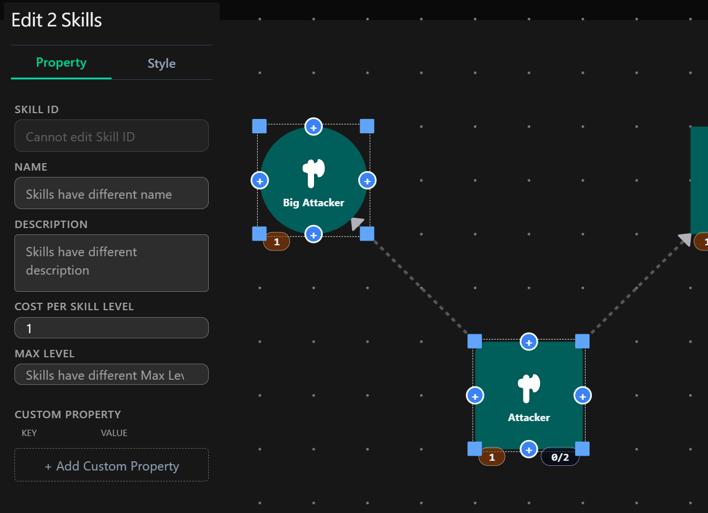

# VueSkillTree
This tool is made to design skill trees for games.

# Workflow
1. Prepare skill data table

2. Use this program to adjust skill positions and type in skill id.

3. Import the data table as TSV format(.tsv)

4. Done

## Export Options

1. **Save Editor Data** : Export the entire editor data to preserve the current editor state.
2. **Import Editor Data** : Import previously saved editor data to restore the editor state.
3. **Import TSV data** : Import a TSV file and use the Skill ID to find and update the corresponding skills.
4. **Export Game Data** :  Export the data required by the game engine as JSON.

# Features
- Edit multiple skills at the same time

- Add custom properties to skills

- Import external TSV files and automatically apply the data to corresponding skills

# Usage
[Use it online](https://notveryfun.github.io/VueSkillTree/)

You can also clone the repository and build the project yourself, then serve the generated files with any web server.
Since the editor runs entirely in the browser, it can also be used offline after being built.

# Built With
- Vue
- Tailwind CSS
- TypeScript
- Vue-flow
- shadcn-vue (UI)

# Credit
## Skill Icons
Skill icons are from

https://nieobie.itch.io/free-icons
## UI Icons

Web UI icons are provided by Lucide.

## UI Components

This project uses components from shadcn-vue.